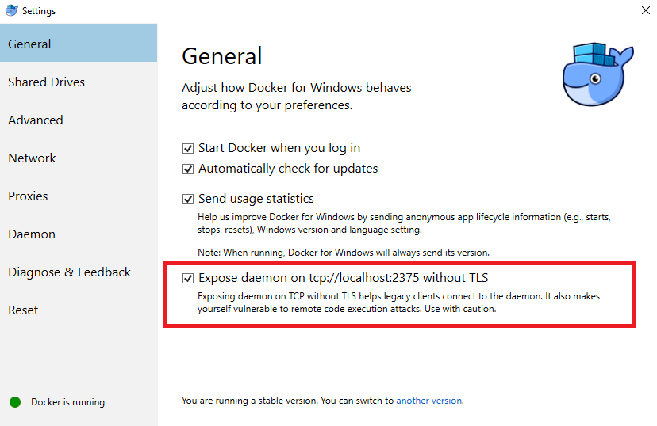
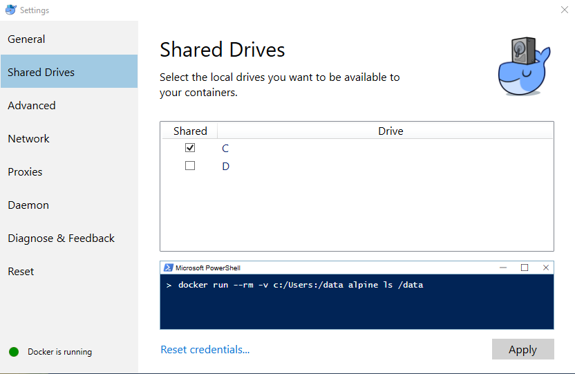
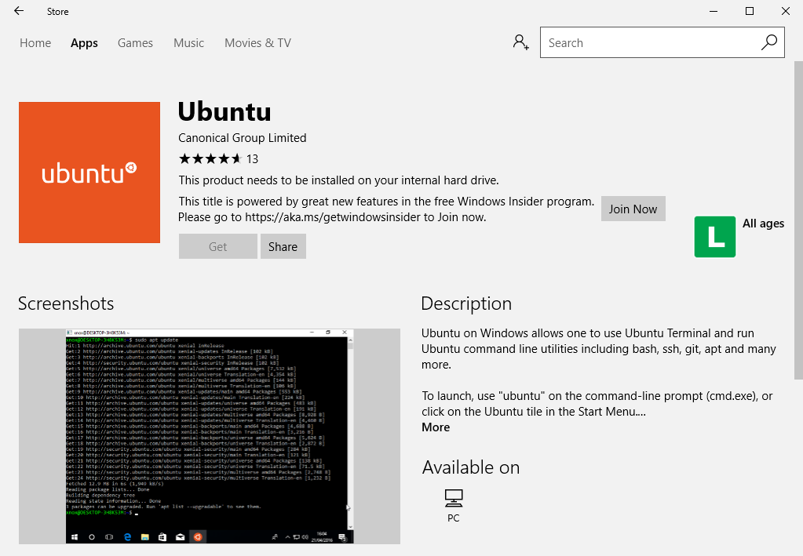

# Installing on Windows

## Installing Docker for Windows

1. Download and install latest Docker for windows at: https://docs.docker.com/docker-for-windows/install/#download-docker-for-windows
2. Click with the Right button on the Docker icon at the taskbar and then click in "Settings"
3. In the "General" select "Expose Daemon on tcp://localhost:2375 without TLS".

4. Then click on "Sahred Drives" and select your drive "C:"


## Installing USDocker using Nodejs.org package

Use this method or Windows Bash.

1. Download and Install latest node.js for Windows at: https://nodejs.org/en/download/
2. Open the Node.js prompt
```
npm i -g usdocker-<yourscript>
```
3. Setting to connect to your local docker instance:
```
usdocker --global docker-host=http://localhost:2375
```

## Installing USDocker using Windows Bash

Use this method or Nodejs.org package

1. Open the Windows store and search for Ubuntu
 
2. After install restart your computer
3. Open the windows bash and install USDocker
```
npm i -g usdocker-<yourscript>
```
4. Setting to connect to your local docker instance:
```
usdocker --global docker-host=http://localhost:2375
```
